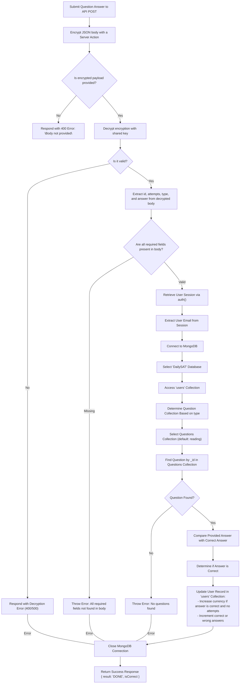

## 📝 Handling Submitting of SAT Questions

This flow visually shows the logic that was implemented for submitting a math or English question for checking its correctness + earning DailySAT Coins. The code associated to this workflow is available on `/src/app/api/practice/route.ts`

